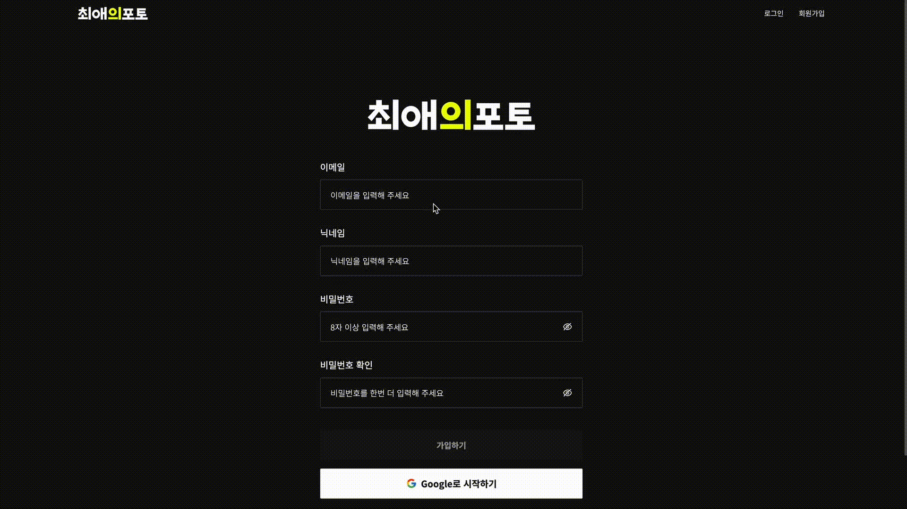
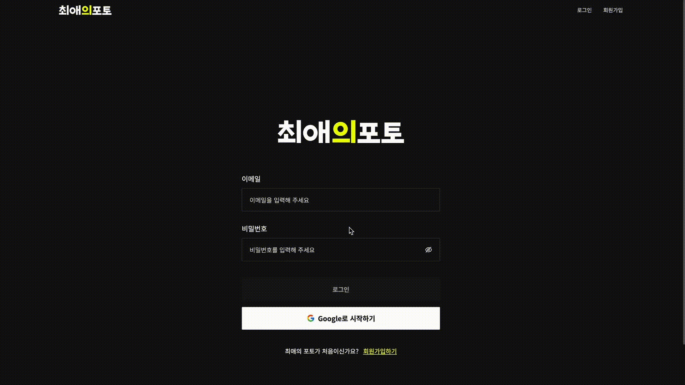
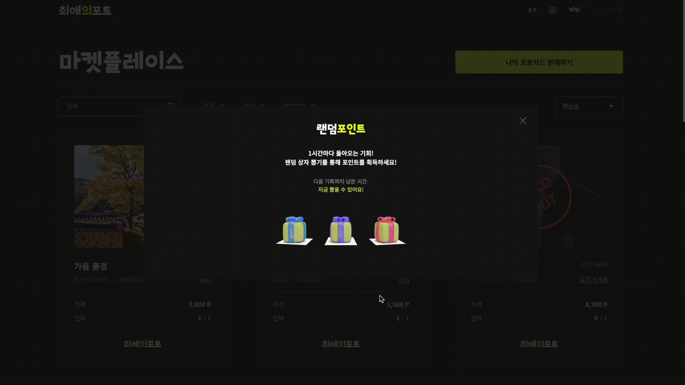
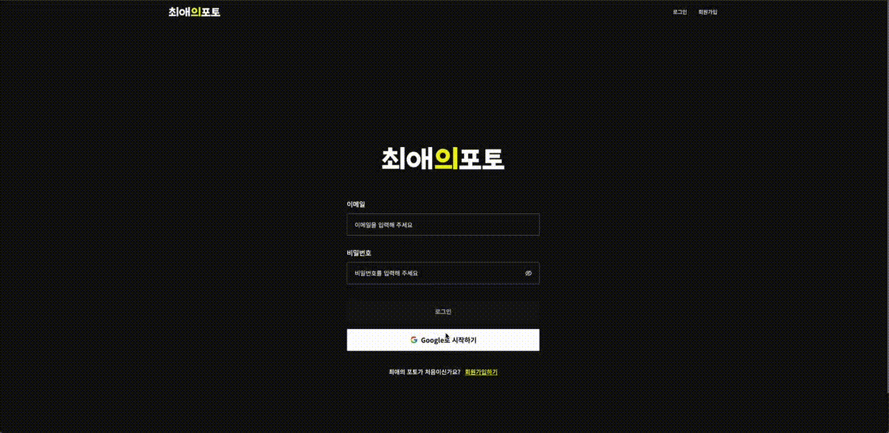
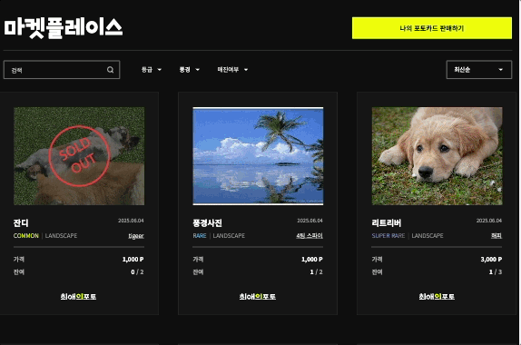
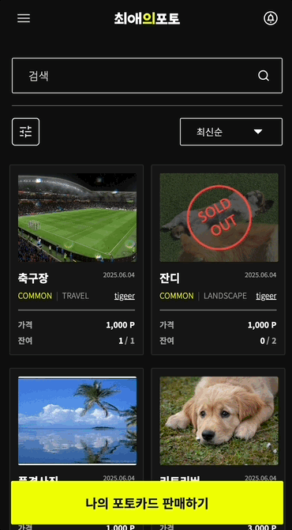
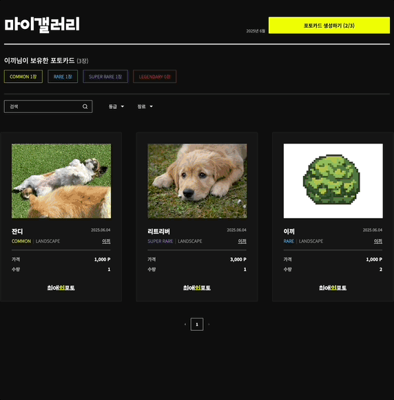
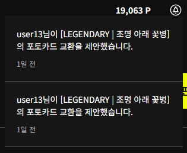

# **2팀**


[팀 노션 페이지](https://www.notion.so/danikim8/2-1ed826aac9d5803c9475ef1eac9835ab)

## **팀원 구성**

김단이 ([개인 Github 링크](https://github.com/danikim8))

김승준 ([개인 Github 링크](https://github.com/y10b))

백지연 ([개인 Github 링크](https://github.com/jyeon03))

오보람 ([개인 Github 링크](https://github.com/elisaohh))

윤세준 ([개인 Github 링크](https://github.com/YSJ0228))

임정빈 ([개인 Github 링크](https://github.com/jbinyim))

---

## **프로젝트 소개**

- "최애의 포토"는 디지털 시대의 새로운 수집 문화를 선도하는 디지털 포토카드 거래 플랫폼입니다. 사용자는 자신이 좋아하는 인물, 사물, 풍경 등의 디지털 포토카드를 손쉽게 구매하고 교환할 수 있으며, 나만의 카드 앨범을 꾸미고 자랑하는 재미도 함께 누릴 수 있습니다.
  본 프로젝트는 LCK 선수 카드 디지털 컬렉터블 플랫폼을 운영 중인 ‘레전더리스’의 실무 환경을 반영하여, 유저 간 C2C 카드 거래, 포인트 기반 구매 시스템, 유저 권한 분리, 알림 시스템, 검색/필터/정렬 기능, 무한 스크롤 등 실전에서 사용되는 핵심 기능을 직접 구현해보는 것을 목표로 합니다.

### 주요 기능

- 랜딩 페이지
  - 로그인 전 소개 페이지, 로그인 시 바로 서비스로 이동
- 인증
  - 회원가입, 로그인, 로그아웃 기능
- 포토 카드
  - 마켓에서 카드 검색/구매/판매/교환 가능
  - 카드 상세 관리 및 교환 제안 승인
  - 알림 기능
  - 내 갤러리에서 카드 관리
- 포인트
  - 1시간에 1번 랜덤 상자 뽑기 기능
  - 포인트 적립 및 구매 판매에 따라 포인트 차감 구현
- 생성 제한
  - 한 달에 카드 3장 생성 제한
  - 카드별 최대 10장 발행 가능
- OAuth 인증
  - 구글 로그인 회원가입 지원
- 랜딩 페이지 최적화
  - SEO, 폰트, 이미지 최적화 및 성능 개선
- 코드 아키텍처
  - Router, Controller, Service, Repository 구조 적용
- 프로젝트 기간: 2025.05.14 ~2025.06.05

---

## **기술 스택**

- Frontend: JavaScript, Next.js,
- Backend: Express.js, PrismaORM
- Database: postgreSQL
- 공통 Tool: Git & Github, Discord, notion

---

## **팀원별 구현 기능 상세**

### **김단이**

<details>
  <summary>회원가입</summary>



</details>

<details>
  <summary>로그인</summary>



</details>

<details>
  <summary>랜덤 포인트 뽑기</summary>



</details>

<details>
  <summary>구글 로그인</summary>



</details>

- **로그인 / 회원가입**
  - JWT + Refresh Token 기반 로그인/회원가입 구현
  - OAuth(Google) 로그인 연동
  - 로그인 후 사용자 정보 저장 및 모달 알림 표시
- **포인트 뽑기**
  - 1시간 쿨타임 랜덤 포인트 지급 기능 구현
  - 쿨타임 체크 및 초기화 API 연동
- **입력 컴포넌트**
  - `Input`, `TokenInput`, `CounterInput` 등 입력 UI 컴포넌트 구현

### **김승준**

(자신이 개발한 기능에 대한 사진이나 gif 파일 첨부)

- **카드**
  - CardOverview: 이미지, 정보, 버튼을 타입에 따라 레이아웃 분기 처리로 구현
  - CardProfile: 사용자의 역할에 따라 타입을 나누고 레이아웃 분기 처리로 구현
- **노헤드**
  - 페이지 상단 기본 헤더를 감추고 반응형으로 각 다른 반응형으로 구현
- **카드모달**
  - 전역 모달 시스템을 사용하여 모달 밖 영역이 안보이는 UI 구현
- **유틸함수**
  - 자주 사용하는 grade 스타일을 매핑하는 함수 구현
- **스켈레톤 UI**
  - 공통 컴포넌트 `SkeletonBox`를 제작해 일관된 스타일 적용
  - 주요 사용되는 컴포넌트에 대한 스켈레톤 UI 제작
- **구매 기능**
  - 구매 가능 여부를 판단하여 버튼 UI를 다르게 보이게 처리
  - 구매할 포토카드 정보 조회
  - 판매자일 경우 sale 페이지로 이동 기능 구현

### **백지연**

<details>
  <summary>판매 기능</summary>


</details>

- **판매 기능(Desktop: 모달, Tablet: 바텀시트, Mobile: 페이지)**
  - 판매 등록
  - 판매 조회
  - 판매 상세 페이지(조회, 수정, 삭제)

### **오보람**

<details>
  <summary>마켓플레이스</summary>



</details>

<details>
  <summary>필터 바텀시트</summary>



</details>

<details>
  <summary>마이갤러리</summary>



</details>

<details>
  <summary>페이지네이션</summary>


</details>

<details>
  <summary>로딩 스피너</summary>


</details>

- **공용 Modal 컴포넌트, 로딩스피너**
  - 공용으로 사용할 반응형 Modal 컴포넌트 구현
  - 로딩 스피너 구현
- **조회/생성 기능**
  - 마켓 플레이스/마이갤러리/나의 판매 포토카드 조회
  - 포토카드 생성 페이지
  - 페이지 메인 레이아웃 및 필터 바텀시트
  - 검색, 필터, 정렬, 무한스크롤, 페이지네이션 구현

### **윤세준**

<details>
  <summary>교환 요청</summary>
  


</details>

<details>
  <summary>교환 요청 취소</summary>
  


</details>

<details>
  <summary>교환 요청 승인</summary>
  


</details>

<details>
  <summary>교환 요청 거절</summary>
  


</details>


- **공통 버튼 컴포넌트 구현**
  - 반응형 Button 컴포넌트 구현
- **교환 기능**
  - 판매 포토카드에 대해서 내가 가지고 있는 포토카드로 교환 가능
  - 포토카드 교환 요청 취소 가능
  - 판매자는 구매자가 포토카드 교환 요청한걸 거절,승인 가능

### **임정빈**

(자신이 개발한 기능에 대한 사진이나 gif 파일 첨부)




- **랜딩 페이지**
  - 로그인하지 않은 사용자에게는 서비스를 소개하는 랜딩 페이지가 보여집니다
- **알림 Modal 컴포넌트**
  - 주요 이벤트가 발생했을 때 알림이 갑니다. (교환 제안 도착, 교환 제안 승인/거절, 카드가 구매됨)
- **공용 Header 컴포넌트**
  - 공용으로 사용할 Header 컴포넌트 구현
- **초기 세팅**
  - 공통 스타일을 위한 환경을 설정 했습니다.

---

## **파일 구조**

```
6-Photo-2-FE
├─ public
│  ├─ dev
│  ├─ fonts
│  │  ├─ BRB.woff2
│  │  ├─ NotoSansKR-Bold.woff2
│  │  ├─ NotoSansKR-Light.woff2
│  │  └─ NotoSansKR-Regular.woff2
│  ├─ icons
│  ├─ images
└─ src
   ├─ app
   │  ├─ auth
   │  │  ├─ callback
   │  │  │  └─ page.jsx
   │  │  ├─ login
   │  │  │  └─ page.jsx
   │  │  └─ signup
   │  │     └─ page.jsx
   │  ├─ globals.css
   │  ├─ layout.js
   │  ├─ market
   │  │  └─ page.jsx
   │  ├─ my-gallery
   │  │  ├─ create
   │  │  │  └─ page.jsx
   │  │  └─ page.jsx
   │  ├─ not-found.jsx
   │  ├─ page.jsx
   │  ├─ providers.jsx
   │  ├─ purchase
   │  │  └─ [id]
   │  │     └─ page.jsx
   │  └─ sale
   │     ├─ [id]
   │     │  └─ page.jsx
   │     └─ page.jsx
   ├─ components
   │  ├─ card
   │  │  └─ ExchangeInfo.jsx
   │  ├─ common
   │  │  ├─ BottomSheet.jsx
   │  │  ├─ Button.jsx
   │  │  ├─ GoogleButton.jsx
   │  │  ├─ Modal.jsx
   │  │  ├─ PointDrawModal.jsx
   │  │  ├─ ToastMessage.jsx
   │  │  └─ TransactionSection.jsx
   │  ├─ exchange
   │  │  ├─ ExchangeCard.jsx
   │  │  ├─ ExchangeConfirmContent.jsx
   │  │  ├─ ExchangeInfoSection.jsx
   │  │  ├─ ExchangeModal.jsx
   │  │  ├─ ExchangeOfferModal.jsx
   │  │  ├─ ExchangeSuggest.jsx
   │  │  └─ MyExchangeList.jsx
   │  ├─ layout
   │  │  ├─ AppInitializer.jsx
   │  │  ├─ Header.jsx
   │  │  ├─ NoHeader.jsx
   │  │  ├─ NotificationModal.jsx
   │  │  ├─ ProfileMobileModal.jsx
   │  │  ├─ ProfileModal.jsx
   │  │  └─ WrapperLayout.jsx
   │  ├─ market
   │  │  ├─ EditCardModal.jsx
   │  │  ├─ FilterBottomSheet.jsx
   │  │  ├─ FilterBottomSheet2.jsx
   │  │  ├─ MyCardsSellBottomSheet.jsx
   │  │  ├─ Pagination.jsx
   │  │  └─ SellCardRegistrationBottomSheet.jsx
   │  ├─ modal
   │  │  ├─ ModalContext.jsx
   │  │  ├─ ModalRenderer.jsx
   │  │  ├─ PointModalRenderer.jsx
   │  │  ├─ ResponsiveModalWrapper.jsx
   │  │  └─ layout
   │  │     ├─ AlertModal.jsx
   │  │     ├─ BottomSheetModal.jsx
   │  │     ├─ CardModal.jsx
   │  │     ├─ DesktopModal.jsx
   │  │     ├─ FullScreenModal.jsx
   │  │     └─ PointModal.jsx
   │  └─ ui
   │     ├─ LoadingSpinner.jsx
   │     ├─ card
   │     │  ├─ cardOverview
   │     │  │  ├─ CardImage.jsx
   │     │  │  ├─ CardInfo.jsx
   │     │  │  ├─ CardList.jsx
   │     │  │  ├─ CardOverview.jsx
   │     │  │  ├─ ExchangeButtons.jsx
   │     │  │  ├─ ExchangeInfo.jsx
   │     │  │  ├─ GradeGenreNickname.jsx
   │     │  │  ├─ GradeGenreNicknameMarket.jsx
   │     │  │  ├─ MarketInfo.jsx
   │     │  │  ├─ PriceQuantity.jsx
   │     │  │  └─ Title.jsx
   │     │  └─ cardProfile
   │     │     ├─ BuyerCardItem.jsx
   │     │     ├─ CardBasicItem.jsx
   │     │     ├─ CardDetailItem.jsx
   │     │     ├─ CardProfile.jsx
   │     │     └─ SellerCardItem.jsx
   │     ├─ input
   │     │  ├─ AuthInput.jsx
   │     │  ├─ CounterInput.jsx
   │     │  ├─ DropdownInput.jsx
   │     │  ├─ Input.jsx
   │     │  ├─ SearchInput.jsx
   │     │  ├─ TextboxInput.jsx
   │     │  ├─ TokenInput.jsx
   │     │  ├─ UploadInput.jsx
   │     │  └─ index.js
   │     └─ skeleton
   │        ├─ BuyerCardItemSkeleton.jsx
   │        ├─ CardBasicItemSkeleton.jsx
   │        ├─ CardDetailItemSkeleton.jsx
   │        ├─ CardImageSkeleton.jsx
   │        ├─ CardInfoSkeleton.jsx
   │        ├─ CardOverviewSkeleton.jsx
   │        ├─ CardProfileSkeleton.jsx
   │        ├─ ExchangeInfoSkeleton.jsx
   │        ├─ ExchangeSuggestSkeleton.jsx
   │        ├─ SellerCardItemSkeleton.jsx
   │        ├─ SkeletonBox.jsx
   │        └─ TransactionSkeleton.jsx
   ├─ hooks
   │  ├─ useAccessToken.js
   │  ├─ useBreakpoint.js
   │  ├─ useBuyerCardHandlers.js
   │  ├─ useDebounce.js
   │  ├─ useFilteredCards.js
   │  ├─ useLocalUser.js
   │  ├─ useMarketInfiniteCards.js
   │  ├─ useMediaQuery.js
   │  └─ useNotificationQuery.js
   ├─ lib
   │  ├─ api
   │  │  ├─ auth-service.js
   │  │  ├─ exchange.js
   │  │  ├─ galleryApi.js
   │  │  ├─ marketApi.js
   │  │  ├─ notificationApi.js
   │  │  ├─ purchase.js
   │  │  ├─ shop.js
   │  │  └─ user-service.js
   │  └─ fetchClient.js
   ├─ providers
   │  ├─ AuthProvider.jsx
   │  ├─ ReactQueryProvider.jsx
   │  └─ RouteGuard.jsx
   ├─ schemas
   │  ├─ login.schema.js
   │  └─ signup.schema.js
   └─ utils
      ├─ countFilterValues.js
      ├─ filterOptions.js
      ├─ formatCardGrade.js
      ├─ formatRelativeTime.js
      └─ gradeStyles.js

```
